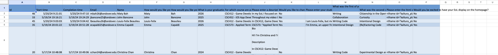
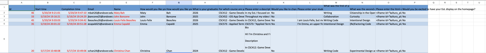

# Batch Uploading EoLs Instructions
## Copy the form
    The first step in the process of uploading EoLs is to make a duplicate of the student EoL microsoft form for your usage.  The template can be found below.  Once you have made your own copy of the form, you can distribute it to your students to be filled out with the information for their EoLs through canvas or other means.
    Template for the form: https://forms.office.com/Pages/ShareFormPage.aspx?id=2etliuh7d0S1RZtt-BrSo-shzA53ZJFHmJ4Cho_aCRBUMFBQMjRWMlNNN1BBQ0ZBU1gwVFpFT1c3Vy4u&sharetoken=q3vTgBKhFaNhhVytIUrL 
## Export Data as an Excel Sheet
    Once all the students have submitted information to the form, the data that was collected can then be exported as an excel sheet.  Before proceeding, review the data written by students to ensure there are no errors or details that the teacher must manually alter.  The excel file should look something like this:

## Moving Data into Batch Upload Template
    To better work with the website's code, the xlsx file that will be uploaded is a separate template than that which the microsoft form derives.  Once you have reviewed the form’s data, copy and paste it into the template below.  Several fields in the form data including the name, timestamp, and id will not be used in the final batch upload form.  The fields highlighted in red in the image below will not be used.  From there, copy and paste the information from the form's data into their respective fields in the EoL upload form.  Additionally, the last three fields of the upload form (teacher_eamil, academic_year, and term) need to be filled in by the teacher and should be the same across all EoLs.  The upload form template can be found here: https://docs.google.com/spreadsheets/d/1aa_OA5dHOu7ps5N8lpN580LpyOZo2NbgJCFGNTN51bY/edit?usp=sharing

## Uploading the form to the website
    Once the upload form has been completed, proceed to the admin page of the EoL website and enter your login credentials as a teacher.  Find the upload button, select the upload file, and submit it to the website.  From there, you are all set and the EoLs will be uploaded to the database.
