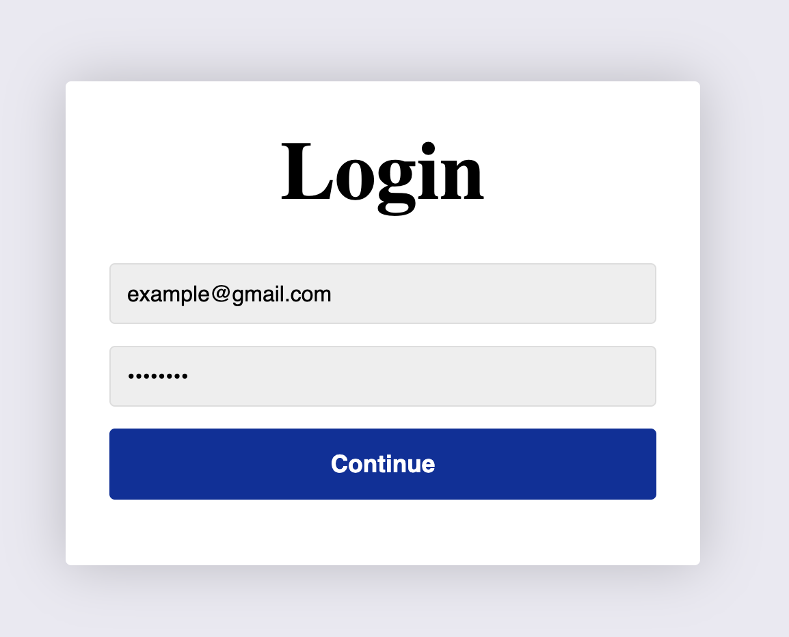
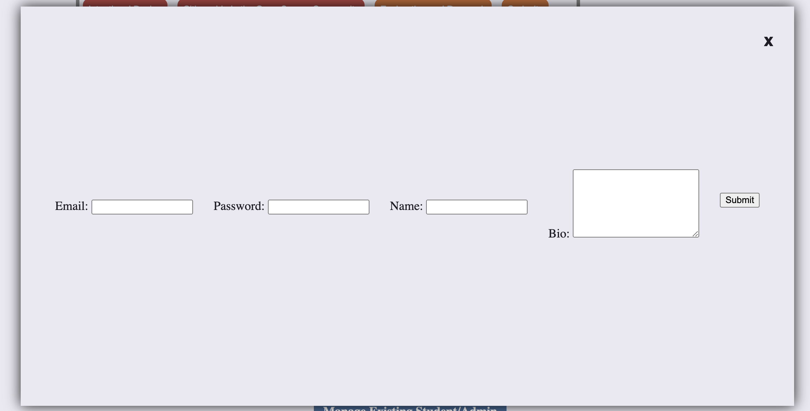
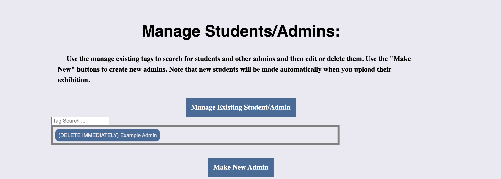
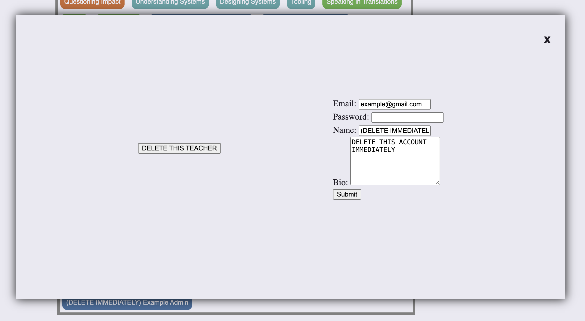

# How to Create a First Admin Account
## Login Using Example Admin Account Info
1. Go to /admin-login page
2. Enter example admin account (seeded into the database already--if you haven't seeded your data yet, please see heroku_setup.md). Email: example@gmail.com. Password: password.

Login page should look like above

## Make Another Admin Account
1. Click on the "Make New Admin" button
2. This should open a create admin form, see picture below:

3. Enter your information (make sure to write it all down!)
4. Click submit!

## Delete The Example Admin Account
1. Scroll down on /admin-home page (after successful login)
2. Open the "manage existing student/admin" button

3. Click on the button titled "(DELETE IMMEDIATELY) Example Admin" (see above picture)
4. Click on the "DELETE THIS TEACHER" button (this will delete the example account from the database)
