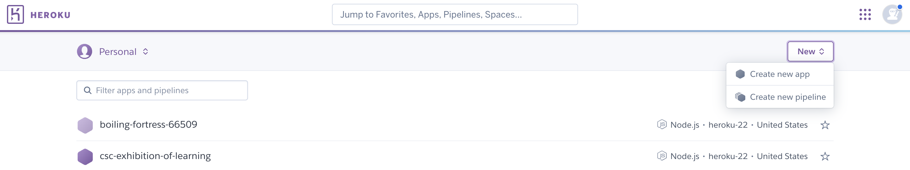
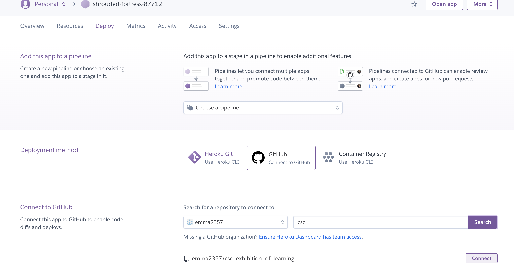
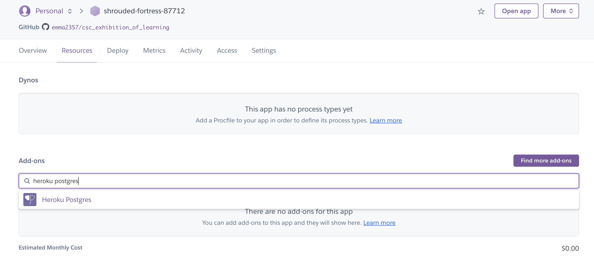
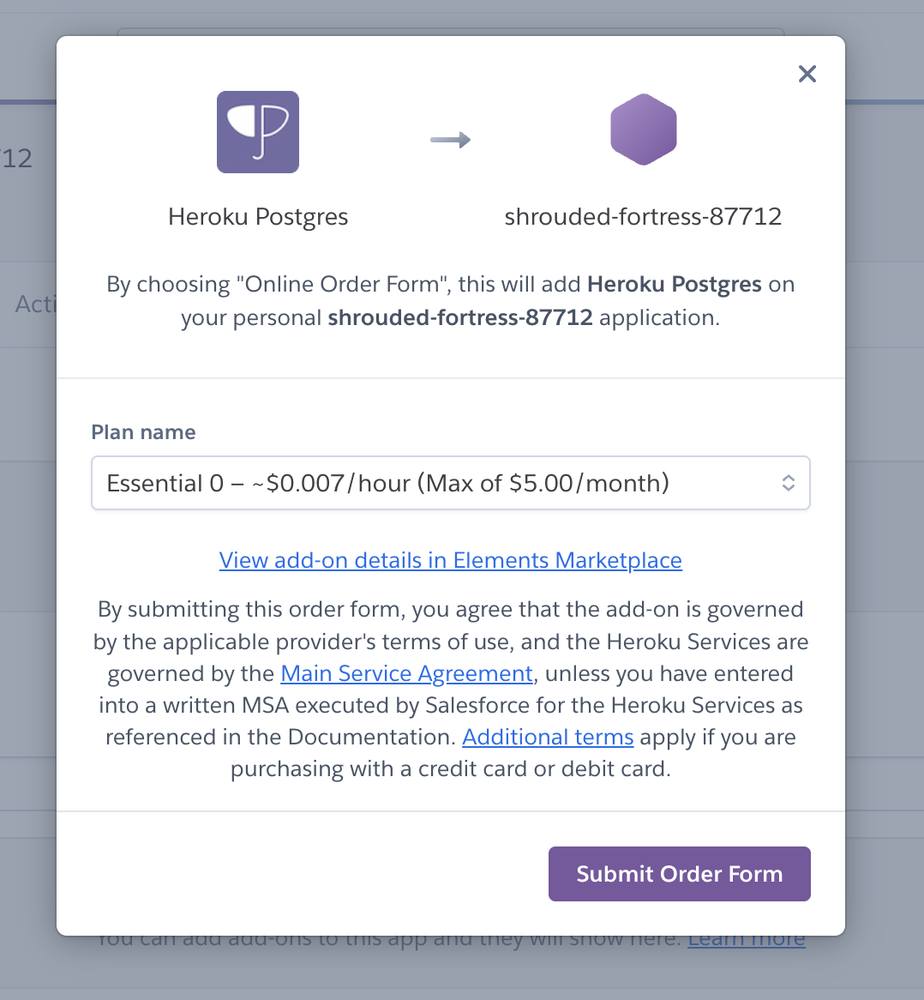
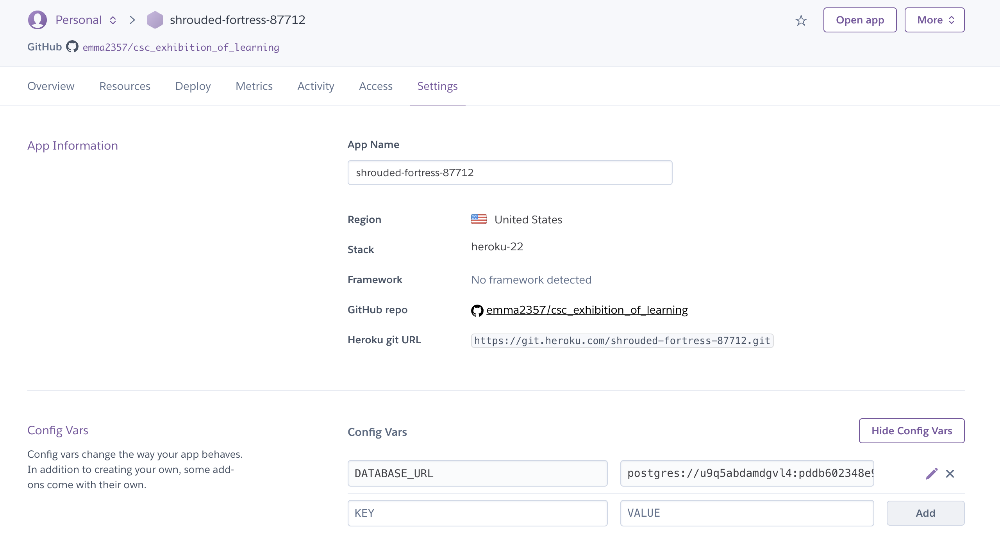
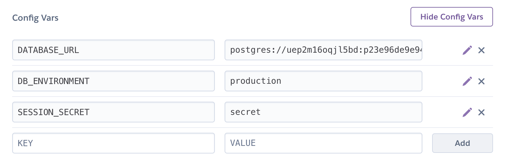
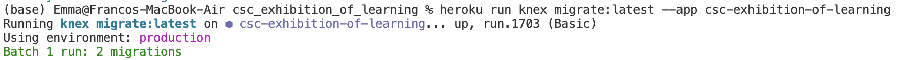
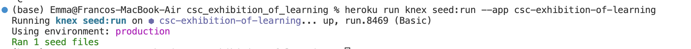

# Heroku Set Up
## Create Heroku App
1. Make an account with Heroku. Then go to app page: https://dashboard.heroku.com/apps
2. Create new app

3. Connect your new app with this GitHub Repository
    1. Go to "Deploy" header
    2. Select "GitHub" as deployment method
    3. search for repository to connect to (your heroku account should be connected to your github account)
    4. Connect

4. Add Heroku Postgres Add-On
    1. Go to "Resources" header
    2. Search for "Heroku Postgres" addon

    3. Submit Order Form (it will take some time for the order to take effect)

## Initialize Configuration Variables
1. Set up Configuration Variables
    1. Go to "Settings" header
    2. Check that DATABASE_URL config var exists

    3. Add new config vars
        1. DB_PRODUCTION = production
        2. SESSION_SECRET = secret

## Migrate Database to Heroku
1. Install the Heroku command line interface according instructions found on this page and briefly explained below: https://devcenter.heroku.com/articles/heroku-cli
    1. Open this github repository, and in the terminal enter this command: npm install -g heroku
    2. Run the following login command to sign into your heroku account: heroku login

2. In the terminal of this github repository, migrate your database using the following command: heroku run knex migrate:latest --app [APP_NAME_HERE]

The output from github should look something like above

## Seed Initial Data to Database
1. Check over 01_seed.js file (found in db/seeds) -- is this data (skill info and course info) correct? If not, update that code with the correct skill and course info
2. In the terminal of this github repository, seed your migrated database using the following command: heroku run knex seed:run --app [APP_NAME_HERE]

The output from github should look something like above

## Go Read [Handling First Admin Account.md](first_admin_account.md)
